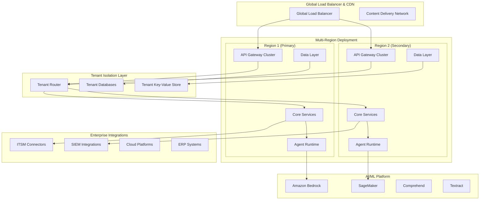
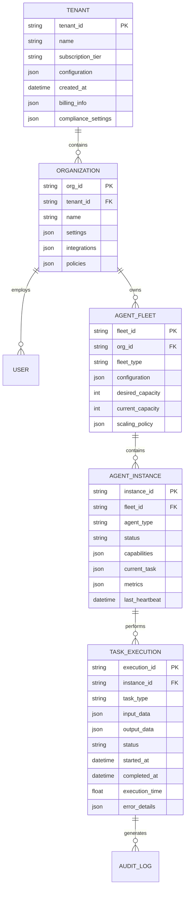

# ACSO Enterprise Framework Design

## Overview

The ACSO Enterprise Framework represents a paradigm shift from traditional IT management tools to an autonomous, AI-driven platform that combines the best aspects of ServiceNow's workflow automation, Splunk's analytics capabilities, and CrowdStrike's threat intelligence into a unified, multi-tenant SaaS platform.

This design transforms the current prototype into a commercial-grade framework capable of serving Fortune 500 enterprises and MSPs with millions of endpoints, while maintaining the agility and intelligence that sets it apart from legacy solutions.

## Architecture

### High-Level System Architecture



### Core Components and Interfaces

#### 1. Agent Runtime Engine (ARE)

**Purpose**: Distributed execution environment for autonomous agents with enterprise-grade reliability.

**Key Features**:
- **Horizontal Scaling**: Support for 10,000+ concurrent agents across multiple availability zones
- **Fault Tolerance**: Circuit breakers, bulkheads, and automatic failover mechanisms
- **Resource Management**: Dynamic resource allocation with predictive scaling
- **Agent Lifecycle**: Automated deployment, monitoring, and retirement of agent instances

**Technical Implementation**:
```python
class EnterpriseAgentRuntime:
    def __init__(self):
        self.cluster_manager = KubernetesClusterManager()
        self.load_balancer = IntelligentLoadBalancer()
        self.health_monitor = DistributedHealthMonitor()
        self.resource_optimizer = PredictiveResourceOptimizer()
        
    async def deploy_agent_fleet(self, agent_specs: List[AgentSpec]) -> FleetDeployment:
        """Deploy and manage a fleet of agents across the cluster."""
        pass
        
    async def scale_agents(self, scaling_policy: ScalingPolicy) -> ScalingResult:
        """Dynamically scale agent instances based on demand."""
        pass
```

#### 2. Multi-Tenant Architecture Layer (MTAL)

**Purpose**: Complete tenant isolation with shared infrastructure efficiency.

**Key Features**:
- **Namespace Isolation**: Kubernetes namespaces with network policies
- **Data Segregation**: Tenant-specific databases with encryption at rest
- **Resource Quotas**: Configurable limits per tenant with burst capabilities
- **Billing Integration**: Real-time usage tracking and cost allocation

**Technical Implementation**:
```python
class TenantManager:
    def __init__(self):
        self.namespace_manager = KubernetesNamespaceManager()
        self.database_provisioner = TenantDatabaseProvisioner()
        self.billing_tracker = UsageBasedBillingTracker()
        self.compliance_enforcer = ComplianceEnforcer()
        
    async def provision_tenant(self, tenant_config: TenantConfig) -> TenantEnvironment:
        """Provision complete isolated environment for new tenant."""
        pass
        
    async def enforce_resource_limits(self, tenant_id: str, limits: ResourceLimits):
        """Enforce resource quotas and billing limits."""
        pass
```

#### 3. Intelligent Agent Orchestrator (IAO)

**Purpose**: Advanced coordination and decision-making for complex multi-agent workflows.

**Key Features**:
- **Emergent Intelligence**: Agents learn from collective experiences
- **Dynamic Task Allocation**: AI-driven workload distribution
- **Conflict Resolution**: Automated resolution of competing agent actions
- **Goal Decomposition**: Natural language to executable task conversion

**Technical Implementation**:
```python
class IntelligentOrchestrator:
    def __init__(self):
        self.goal_decomposer = NeuralGoalDecomposer()
        self.task_allocator = ReinforcementLearningAllocator()
        self.conflict_resolver = ConsensusBasedResolver()
        self.learning_engine = FederatedLearningEngine()
        
    async def orchestrate_complex_workflow(self, goal: NaturalLanguageGoal) -> WorkflowExecution:
        """Convert high-level goals into coordinated agent actions."""
        pass
        
    async def resolve_agent_conflicts(self, conflicts: List[AgentConflict]) -> Resolution:
        """Intelligently resolve competing agent actions."""
        pass
```

#### 4. Enterprise Integration Hub (EIH)

**Purpose**: Seamless connectivity with existing enterprise systems.

**Key Features**:
- **Universal Connectors**: Pre-built integrations for 50+ enterprise systems
- **Real-time Sync**: Event-driven architecture with guaranteed delivery
- **Data Transformation**: Intelligent mapping between different data formats
- **API Management**: Rate limiting, authentication, and monitoring

**Technical Implementation**:
```python
class IntegrationHub:
    def __init__(self):
        self.connector_registry = ConnectorRegistry()
        self.event_bus = EnterpriseEventBus()
        self.data_transformer = IntelligentDataTransformer()
        self.api_gateway = EnterpriseAPIGateway()
        
    async def establish_integration(self, system_config: SystemConfig) -> Integration:
        """Establish real-time integration with enterprise system."""
        pass
        
    async def sync_data_bidirectional(self, integration_id: str, sync_config: SyncConfig):
        """Maintain bidirectional data synchronization."""
        pass
```

### Data Models

#### Core Entity Relationships



#### Advanced Data Structures

**Agent Memory Model**:
```python
class EnterpriseAgentMemory:
    def __init__(self):
        self.episodic_memory = VectorDatabase()  # Experiences and events
        self.semantic_memory = KnowledgeGraph()  # Facts and relationships
        self.procedural_memory = SkillRegistry()  # Learned procedures
        self.working_memory = DistributedCache()  # Current context
        
    async def store_experience(self, experience: AgentExperience):
        """Store agent experience for future learning."""
        pass
        
    async def retrieve_relevant_knowledge(self, context: TaskContext) -> Knowledge:
        """Retrieve relevant knowledge for current task."""
        pass
```

**Financial Intelligence Model**:
```python
class FinancialIntelligenceEngine:
    def __init__(self):
        self.cost_analyzer = MLCostAnalyzer()
        self.roi_calculator = AdvancedROICalculator()
        self.forecasting_engine = TimeSeriesForecastingEngine()
        self.optimization_engine = ConstraintOptimizationEngine()
        
    async def analyze_cost_patterns(self, cost_data: CostDataset) -> CostInsights:
        """Analyze spending patterns and identify optimization opportunities."""
        pass
        
    async def predict_budget_requirements(self, historical_data: HistoricalData) -> BudgetForecast:
        """Predict future budget requirements with confidence intervals."""
        pass
```

### Error Handling

#### Distributed Error Management

**Error Classification System**:
```python
class EnterpriseErrorHandler:
    def __init__(self):
        self.error_classifier = MLErrorClassifier()
        self.recovery_orchestrator = AutoRecoveryOrchestrator()
        self.escalation_manager = IntelligentEscalationManager()
        self.learning_engine = ErrorLearningEngine()
        
    async def handle_system_error(self, error: SystemError) -> ErrorResolution:
        """Intelligently handle and recover from system errors."""
        classification = await self.error_classifier.classify(error)
        
        if classification.severity == "CRITICAL":
            await self.escalation_manager.escalate_immediately(error)
        elif classification.recoverable:
            recovery_plan = await self.recovery_orchestrator.create_recovery_plan(error)
            await self.execute_recovery(recovery_plan)
        
        # Learn from the error for future prevention
        await self.learning_engine.learn_from_error(error, classification)
        
        return ErrorResolution(
            resolved=True,
            recovery_time=recovery_plan.estimated_time,
            prevention_measures=classification.prevention_recommendations
        )
```

**Circuit Breaker Pattern Implementation**:
```python
class EnterpriseCircuitBreaker:
    def __init__(self, failure_threshold: int = 5, recovery_timeout: int = 60):
        self.failure_threshold = failure_threshold
        self.recovery_timeout = recovery_timeout
        self.failure_count = 0
        self.last_failure_time = None
        self.state = CircuitState.CLOSED
        
    async def call_with_circuit_breaker(self, func: Callable, *args, **kwargs):
        """Execute function with circuit breaker protection."""
        if self.state == CircuitState.OPEN:
            if self._should_attempt_reset():
                self.state = CircuitState.HALF_OPEN
            else:
                raise CircuitBreakerOpenException()
        
        try:
            result = await func(*args, **kwargs)
            await self._on_success()
            return result
        except Exception as e:
            await self._on_failure(e)
            raise
```

### Testing Strategy

#### Comprehensive Testing Framework

**1. Agent Behavior Testing**:
```python
class AgentBehaviorTestSuite:
    def __init__(self):
        self.simulation_environment = AgentSimulationEnvironment()
        self.behavior_validator = BehaviorValidator()
        self.performance_profiler = PerformanceProfiler()
        
    async def test_agent_decision_making(self, agent: Agent, scenarios: List[Scenario]):
        """Test agent decision-making across various scenarios."""
        for scenario in scenarios:
            decision = await agent.make_decision(scenario.context)
            validation_result = await self.behavior_validator.validate_decision(
                decision, scenario.expected_outcome
            )
            assert validation_result.is_valid, f"Invalid decision for scenario {scenario.id}"
    
    async def test_multi_agent_coordination(self, agents: List[Agent], coordination_task: Task):
        """Test coordination between multiple agents."""
        coordination_result = await self.simulation_environment.execute_coordination_task(
            agents, coordination_task
        )
        assert coordination_result.success_rate > 0.95
        assert coordination_result.coordination_efficiency > 0.90
```

**2. Load and Stress Testing**:
```python
class EnterpriseLoadTestSuite:
    def __init__(self):
        self.load_generator = DistributedLoadGenerator()
        self.metrics_collector = RealTimeMetricsCollector()
        self.chaos_engineer = ChaosEngineeringFramework()
        
    async def test_system_scalability(self, target_load: LoadProfile):
        """Test system behavior under various load conditions."""
        await self.load_generator.ramp_up_load(target_load)
        
        metrics = await self.metrics_collector.collect_metrics(duration=300)  # 5 minutes
        
        assert metrics.response_time_p95 < 200  # 95th percentile < 200ms
        assert metrics.error_rate < 0.01  # Error rate < 1%
        assert metrics.throughput >= target_load.expected_throughput
    
    async def test_chaos_resilience(self, chaos_scenarios: List[ChaosScenario]):
        """Test system resilience under failure conditions."""
        for scenario in chaos_scenarios:
            await self.chaos_engineer.inject_failure(scenario)
            recovery_time = await self.measure_recovery_time()
            assert recovery_time < scenario.max_acceptable_recovery_time
```

**3. Security Testing**:
```python
class SecurityTestSuite:
    def __init__(self):
        self.penetration_tester = AutomatedPenetrationTester()
        self.vulnerability_scanner = VulnerabilityScanner()
        self.compliance_validator = ComplianceValidator()
        
    async def test_tenant_isolation(self, tenant_configs: List[TenantConfig]):
        """Test complete isolation between tenants."""
        for tenant_a in tenant_configs:
            for tenant_b in tenant_configs:
                if tenant_a.id != tenant_b.id:
                    isolation_result = await self.test_data_isolation(tenant_a, tenant_b)
                    assert isolation_result.data_leakage == False
                    assert isolation_result.cross_tenant_access == False
    
    async def test_encryption_compliance(self):
        """Test encryption at rest and in transit."""
        encryption_audit = await self.compliance_validator.audit_encryption()
        assert encryption_audit.data_at_rest_encrypted == True
        assert encryption_audit.data_in_transit_encrypted == True
        assert encryption_audit.key_management_compliant == True
```

## Implementation Phases

### Phase 1: Core Platform Foundation (Months 1-3)
- Multi-tenant architecture implementation
- Basic agent runtime with Kubernetes orchestration
- Core API gateway with authentication/authorization
- Database design and implementation
- Basic monitoring and logging

### Phase 2: Advanced Agent Intelligence (Months 4-6)
- Enhanced agent coordination and communication
- Machine learning integration for decision-making
- Advanced workflow orchestration
- Real-time analytics and dashboards
- Integration framework foundation

### Phase 3: Enterprise Features (Months 7-9)
- Advanced security and compliance features
- Enterprise integrations (ServiceNow, Splunk, etc.)
- Advanced financial intelligence and ROI optimization
- Global deployment and disaster recovery
- Performance optimization and caching

### Phase 4: Commercial Readiness (Months 10-12)
- White-label customization capabilities
- Advanced billing and subscription management
- Comprehensive documentation and training materials
- Partner ecosystem and marketplace
- Go-to-market preparation

## Deployment Architecture

### Kubernetes-Native Deployment

```yaml
# Enterprise-grade Kubernetes deployment
apiVersion: v1
kind: Namespace
metadata:
  name: acso-enterprise
  labels:
    app: acso
    tier: enterprise
---
apiVersion: apps/v1
kind: Deployment
metadata:
  name: acso-agent-runtime
  namespace: acso-enterprise
spec:
  replicas: 10
  selector:
    matchLabels:
      app: acso-agent-runtime
  template:
    metadata:
      labels:
        app: acso-agent-runtime
    spec:
      containers:
      - name: agent-runtime
        image: acso/agent-runtime:enterprise
        resources:
          requests:
            memory: "2Gi"
            cpu: "1000m"
          limits:
            memory: "4Gi"
            cpu: "2000m"
        env:
        - name: CLUSTER_MODE
          value: "enterprise"
        - name: TENANT_ISOLATION
          value: "strict"
        - name: SCALING_POLICY
          value: "predictive"
```

### Infrastructure as Code

```terraform
# Terraform configuration for multi-region deployment
module "acso_enterprise" {
  source = "./modules/acso-enterprise"
  
  # Global configuration
  environment = "production"
  regions = ["us-east-1", "us-west-2", "eu-west-1"]
  
  # Scaling configuration
  min_agent_instances = 100
  max_agent_instances = 10000
  auto_scaling_enabled = true
  
  # Security configuration
  encryption_at_rest = true
  encryption_in_transit = true
  compliance_mode = "enterprise"
  
  # Monitoring configuration
  monitoring_enabled = true
  alerting_enabled = true
  log_retention_days = 365
  
  # Backup configuration
  backup_enabled = true
  backup_retention_days = 2555  # 7 years
  cross_region_backup = true
}
```

This design provides the foundation for transforming ACSO into a commercial-grade enterprise platform that can compete with industry leaders while maintaining the innovative autonomous AI capabilities that differentiate it in the market.