# ACSO Agentic AI Backend - AWS Architecture Diagram

## Overview
This document contains the comprehensive AWS architecture diagram for the ACSO (Autonomous Cyber-Security & Service Orchestrator) agentic AI backend system.

## Architecture Diagram

```mermaid
graph TB
    %% External Users and Systems
    Users[👥 Users<br/>Security Teams, IT Managers, Executives]
    ExternalSystems[🔗 External Systems<br/>SIEM, ITSM, Threat Intel]
    
    %% Internet Gateway and Load Balancing
    IGW[🌐 Internet Gateway]
    ALB[⚖️ Application Load Balancer<br/>AWS ALB]
    
    %% VPC and Networking
    subgraph VPC["🏢 ACSO VPC (10.0.0.0/16)"]
        
        %% Public Subnets
        subgraph PublicSubnets["🌍 Public Subnets"]
            PubSub1[📍 Public Subnet 1<br/>10.0.101.0/24<br/>us-east-1a]
            PubSub2[📍 Public Subnet 2<br/>10.0.102.0/24<br/>us-east-1b]
            NAT[🔄 NAT Gateway]
        end
        
        %% Private Subnets
        subgraph PrivateSubnets["🔒 Private Subnets"]
            PrivSub1[📍 Private Subnet 1<br/>10.0.1.0/24<br/>us-east-1a]
            PrivSub2[📍 Private Subnet 2<br/>10.0.2.0/24<br/>us-east-1b]
        end
        
        %% ECS Cluster and Services
        subgraph ECSCluster["🐳 ECS Fargate Cluster"]
            SupervisorService[🎯 Supervisor Agent Service<br/>ECS Fargate Task]
            ThreatHunterService[🔍 Threat Hunter Agent Service<br/>ECS Fargate Task]
            IncidentResponseService[🚨 Incident Response Agent Service<br/>ECS Fargate Task]
            ServiceOrchService[⚙️ Service Orchestration Agent Service<br/>ECS Fargate Task]
            FinancialService[💰 Financial Intelligence Agent Service<br/>ECS Fargate Task]
        end
        
        %% API Gateway
        APIGW[🚪 API Gateway<br/>REST API + WebSocket]
        
        %% Security Groups
        ALBSecGroup[🛡️ ALB Security Group<br/>HTTP/HTTPS: 80,443]
        ECSSecGroup[🛡️ ECS Security Group<br/>Internal: 8000,8080]
        DatabaseSecGroup[🛡️ Database Security Group<br/>Internal: 443,5432]
    end
    
    %% AI and ML Services
    subgraph BedrockServices["🧠 Amazon Bedrock Services"]
        BedrockAgents[🤖 Bedrock Agents<br/>Claude-3 Sonnet]
        BedrockKB[📚 Bedrock Knowledge Base<br/>Threat Intelligence]
        BedrockGuardrails[🛡️ Bedrock Guardrails<br/>Safety & Security]
    end
    
    %% Data Storage Services
    subgraph DataServices["💾 Data Storage Services"]
        DynamoDB[📊 DynamoDB<br/>Agent State & Configuration]
        S3Artifacts[🗄️ S3 Bucket<br/>Artifacts & Logs]
        S3ThreatIntel[🗄️ S3 Bucket<br/>Threat Intelligence Data]
        RDS[🗃️ RDS PostgreSQL<br/>Incident & Workflow Data]
    end
    
    %% Message Queue Services
    subgraph MessageServices["📨 Message Queue Services"]
        SQSTaskQueue[📬 SQS Task Queue<br/>Agent Task Distribution]
        SQSTaskDLQ[📬 SQS Dead Letter Queue<br/>Failed Task Handling]
        SNSTopic[📢 SNS Topic<br/>Event Notifications]
        EventBridge[🎯 EventBridge<br/>Event Routing]
    end
    
    %% Monitoring and Logging
    subgraph MonitoringServices["📈 Monitoring & Logging"]
        CloudWatch[📊 CloudWatch<br/>Metrics & Dashboards]
        CloudWatchLogs[📝 CloudWatch Logs<br/>Application Logs]
        XRay[🔍 X-Ray<br/>Distributed Tracing]
        GuardDuty[🛡️ GuardDuty<br/>Threat Detection]
        CloudTrail[📋 CloudTrail<br/>API Audit Logs]
    end
    
    %% Security Services
    subgraph SecurityServices["🔐 Security Services"]
        KMS[🔑 KMS<br/>Encryption Key Management]
        SecretsManager[🔒 Secrets Manager<br/>API Keys & Credentials]
        IAMRoles[👤 IAM Roles<br/>Service Authentication]
        WAF[🛡️ WAF<br/>Web Application Firewall]
        Cognito[🔐 Cognito<br/>User Authentication]
    end
    
    %% Container Registry
    ECR[📦 ECR<br/>Container Registry<br/>Agent Images]
    
    %% Lambda Functions
    subgraph LambdaFunctions["⚡ Lambda Functions"]
        AuthLambda[🔐 Authentication Lambda<br/>JWT Token Validation]
        NotificationLambda[📧 Notification Lambda<br/>Alert Processing]
        DataProcessingLambda[🔄 Data Processing Lambda<br/>Log Analysis]
    end
    
    %% External AWS Services
    subgraph ExternalAWS["☁️ External AWS Services"]
        CostExplorer[💰 Cost Explorer<br/>Financial Analysis]
        SystemsManager[⚙️ Systems Manager<br/>Infrastructure Management]
        ConfigService[📋 Config Service<br/>Compliance Monitoring]
    end
    
    %% Connection Flow
    Users --> IGW
    ExternalSystems --> IGW
    IGW --> WAF
    WAF --> ALB
    ALB --> APIGW
    
    %% VPC Internal Connections
    APIGW --> SupervisorService
    APIGW --> ThreatHunterService
    APIGW --> IncidentResponseService
    APIGW --> ServiceOrchService
    APIGW --> FinancialService
    
    %% Agent Interconnections
    SupervisorService <--> ThreatHunterService
    SupervisorService <--> IncidentResponseService
    SupervisorService <--> ServiceOrchService
    SupervisorService <--> FinancialService
    
    %% AI Service Connections
    SupervisorService --> BedrockAgents
    ThreatHunterService --> BedrockAgents
    IncidentResponseService --> BedrockAgents
    ServiceOrchService --> BedrockAgents
    FinancialService --> BedrockAgents
    
    BedrockAgents --> BedrockKB
    BedrockAgents --> BedrockGuardrails
    
    %% Data Service Connections
    SupervisorService --> DynamoDB
    ThreatHunterService --> DynamoDB
    IncidentResponseService --> DynamoDB
    ServiceOrchService --> DynamoDB
    FinancialService --> DynamoDB
    
    SupervisorService --> S3Artifacts
    ThreatHunterService --> S3ThreatIntel
    IncidentResponseService --> S3Artifacts
    
    SupervisorService --> RDS
    IncidentResponseService --> RDS
    ServiceOrchService --> RDS
    
    %% Message Queue Connections
    SupervisorService --> SQSTaskQueue
    ThreatHunterService --> SQSTaskQueue
    IncidentResponseService --> SQSTaskQueue
    ServiceOrchService --> SQSTaskQueue
    FinancialService --> SQSTaskQueue
    
    SQSTaskQueue --> SQSTaskDLQ
    
    SupervisorService --> SNSTopic
    SNSTopic --> NotificationLambda
    
    SupervisorService --> EventBridge
    EventBridge --> DataProcessingLambda
    
    %% Monitoring Connections
    SupervisorService --> CloudWatch
    ThreatHunterService --> CloudWatch
    IncidentResponseService --> CloudWatch
    ServiceOrchService --> CloudWatch
    FinancialService --> CloudWatch
    
    SupervisorService --> CloudWatchLogs
    ThreatHunterService --> CloudWatchLogs
    IncidentResponseService --> CloudWatchLogs
    ServiceOrchService --> CloudWatchLogs
    FinancialService --> CloudWatchLogs
    
    SupervisorService --> XRay
    ThreatHunterService --> XRay
    IncidentResponseService --> XRay
    ServiceOrchService --> XRay
    FinancialService --> XRay
    
    %% Security Connections
    SupervisorService --> KMS
    ThreatHunterService --> KMS
    IncidentResponseService --> KMS
    ServiceOrchService --> KMS
    FinancialService --> KMS
    
    SupervisorService --> SecretsManager
    ThreatHunterService --> SecretsManager
    IncidentResponseService --> SecretsManager
    ServiceOrchService --> SecretsManager
    FinancialService --> SecretsManager
    
    SupervisorService --> IAMRoles
    ThreatHunterService --> IAMRoles
    IncidentResponseService --> IAMRoles
    ServiceOrchService --> IAMRoles
    FinancialService --> IAMRoles
    
    APIGW --> AuthLambda
    AuthLambda --> Cognito
    
    %% Container Registry Connections
    ECSCluster --> ECR
    
    %% External Service Connections
    FinancialService --> CostExplorer
    ServiceOrchService --> SystemsManager
    SupervisorService --> ConfigService
    
    %% Threat Detection Integration
    ThreatHunterService --> GuardDuty
    ThreatHunterService --> CloudTrail
    
    %% Network Flow
    PubSub1 --> PrivSub1
    PubSub2 --> PrivSub2
    NAT --> PrivSub1
    NAT --> PrivSub2
    
    %% Styling
    classDef userClass fill:#e1f5fe,stroke:#01579b,stroke-width:2px
    classDef networkClass fill:#f3e5f5,stroke:#4a148c,stroke-width:2px
    classDef computeClass fill:#e8f5e8,stroke:#1b5e20,stroke-width:2px
    classDef aiClass fill:#fff3e0,stroke:#e65100,stroke-width:2px
    classDef dataClass fill:#fce4ec,stroke:#880e4f,stroke-width:2px
    classDef messageClass fill:#e0f2f1,stroke:#004d40,stroke-width:2px
    classDef monitorClass fill:#f1f8e9,stroke:#33691e,stroke-width:2px
    classDef securityClass fill:#ffebee,stroke:#b71c1c,stroke-width:2px
    classDef lambdaClass fill:#e8eaf6,stroke:#1a237e,stroke-width:2px
    classDef externalClass fill:#fafafa,stroke:#424242,stroke-width:2px
    
    class Users,ExternalSystems userClass
    class IGW,ALB,VPC,PublicSubnets,PrivateSubnets,PubSub1,PubSub2,PrivSub1,PrivSub2,NAT,APIGW,ALBSecGroup,ECSSecGroup,DatabaseSecGroup networkClass
    class ECSCluster,SupervisorService,ThreatHunterService,IncidentResponseService,ServiceOrchService,FinancialService,ECR computeClass
    class BedrockServices,BedrockAgents,BedrockKB,BedrockGuardrails aiClass
    class DataServices,DynamoDB,S3Artifacts,S3ThreatIntel,RDS dataClass
    class MessageServices,SQSTaskQueue,SQSTaskDLQ,SNSTopic,EventBridge messageClass
    class MonitoringServices,CloudWatch,CloudWatchLogs,XRay,GuardDuty,CloudTrail monitorClass
    class SecurityServices,KMS,SecretsManager,IAMRoles,WAF,Cognito securityClass
    class LambdaFunctions,AuthLambda,NotificationLambda,DataProcessingLambda lambdaClass
    class ExternalAWS,CostExplorer,SystemsManager,ConfigService externalClass
```

## Architecture Components

### 1. **Networking Layer**
- **VPC**: Isolated network environment with public and private subnets
- **Internet Gateway**: Entry point for external traffic
- **Application Load Balancer**: Distributes traffic across agent services
- **NAT Gateway**: Enables outbound internet access for private subnets
- **Security Groups**: Network-level security controls

### 2. **Compute Layer**
- **ECS Fargate Cluster**: Serverless container orchestration
- **Agent Services**: Containerized AI agents running as ECS tasks
- **ECR**: Container registry for agent images
- **Auto Scaling**: Dynamic scaling based on workload

### 3. **AI/ML Services**
- **Amazon Bedrock**: Foundation models for agent intelligence
- **Bedrock Agents**: Specialized AI agents with Claude-3 Sonnet
- **Knowledge Base**: Threat intelligence and domain knowledge
- **Guardrails**: Safety and security controls for AI responses

### 4. **Data Storage**
- **DynamoDB**: Agent state, configuration, and real-time data
- **S3**: Artifacts, logs, and threat intelligence data
- **RDS PostgreSQL**: Structured incident and workflow data
- **Encryption**: All data encrypted at rest using KMS

### 5. **Message Queue Services**
- **SQS**: Task distribution and inter-agent communication
- **SNS**: Event notifications and alerts
- **EventBridge**: Event routing and workflow triggers
- **Dead Letter Queues**: Failed message handling

### 6. **Monitoring & Observability**
- **CloudWatch**: Metrics, dashboards, and alerting
- **CloudWatch Logs**: Centralized logging
- **X-Ray**: Distributed tracing
- **GuardDuty**: Threat detection
- **CloudTrail**: API audit logging

### 7. **Security Services**
- **KMS**: Encryption key management
- **Secrets Manager**: Secure credential storage
- **IAM**: Identity and access management
- **WAF**: Web application firewall
- **Cognito**: User authentication

### 8. **Lambda Functions**
- **Authentication**: JWT token validation
- **Notifications**: Alert processing and routing
- **Data Processing**: Log analysis and transformation

## Data Flow

### 1. **Request Flow**
1. Users/External systems → Internet Gateway
2. Internet Gateway → WAF (security filtering)
3. WAF → Application Load Balancer
4. ALB → API Gateway
5. API Gateway → Agent Services (ECS Fargate)

### 2. **Agent Communication**
1. Supervisor Agent orchestrates workflows
2. Task distribution via SQS queues
3. Inter-agent communication through message bus
4. Results aggregation and reporting

### 3. **AI Processing**
1. Agents invoke Bedrock models for intelligence
2. Knowledge base queries for threat intelligence
3. Guardrails ensure safe AI responses
4. Results stored in DynamoDB/S3

### 4. **Monitoring Flow**
1. All services emit metrics to CloudWatch
2. Logs aggregated in CloudWatch Logs
3. Distributed tracing via X-Ray
4. Security events monitored by GuardDuty

## Security Architecture

### 1. **Network Security**
- VPC isolation with private subnets
- Security groups with least privilege
- WAF protection for public endpoints
- Network ACLs for additional security

### 2. **Data Security**
- Encryption at rest (KMS)
- Encryption in transit (TLS 1.3)
- Secrets management (Secrets Manager)
- Field-level encryption for sensitive data

### 3. **Access Control**
- IAM roles with least privilege
- Service-to-service authentication
- Multi-factor authentication for users
- API authentication via Cognito

### 4. **Monitoring Security**
- GuardDuty for threat detection
- CloudTrail for audit logging
- Real-time security alerting
- Automated incident response

## Scalability Features

### 1. **Horizontal Scaling**
- ECS Fargate auto-scaling
- Application Load Balancer distribution
- DynamoDB on-demand scaling
- Lambda automatic scaling

### 2. **Performance Optimization**
- Multi-AZ deployment
- Read replicas for databases
- CloudFront CDN (if needed)
- Caching strategies

### 3. **High Availability**
- Multi-AZ architecture
- Auto-scaling groups
- Health checks and failover
- Disaster recovery procedures

## Cost Optimization

### 1. **Resource Optimization**
- Fargate Spot instances for non-critical workloads
- S3 Intelligent Tiering
- DynamoDB on-demand pricing
- Reserved instances for predictable workloads

### 2. **Monitoring Costs**
- Cost Explorer integration
- Budget alerts and controls
- Resource tagging for cost allocation
- Regular cost optimization reviews

This architecture provides a robust, scalable, and secure foundation for the ACSO agentic AI system, leveraging AWS managed services to minimize operational overhead while maximizing performance and reliability.