# Professional Architecture Diagrams with Mermaid & AWS Icons

## Complete Guide to Creating Stunning Diagrams in MermaidChart.com

> **⚠️ Interface Update Notice**: MermaidChart.com's interface has evolved since this guide was created. The platform may not have a right sidebar or dedicated icons/assets panel as previously documented. The core functionality and syntax examples remain valid, but interface-specific instructions should be verified against the current platform.

This guide shows how to create professional-grade architecture diagrams using Mermaid syntax with AWS icons from MermaidChart.com for the ACSO system.

## Table of Contents
1. [Getting Started with MermaidChart.com](#getting-started)
2. [AWS Architecture Diagrams](#aws-architecture-diagrams)
3. [Agentic AI Architecture](#agentic-ai-architecture)
4. [Sequence Diagrams](#sequence-diagrams)
5. [Component Diagrams](#component-diagrams)
6. [Workflow Diagrams](#workflow-diagrams)
7. [Relationship Diagrams](#relationship-diagrams)
8. [Advanced Styling & Icons](#advanced-styling--icons)

## Getting Started

### Platform Comparison: MermaidChart.com vs Mermaid.live

| Feature | MermaidChart.com | Mermaid.live |
|---------|------------------|--------------|
| **AWS Icons** | ✅ Full AWS icon library | ❌ Limited icon support |
| **Architecture-Beta** | ✅ Full support | ⚠️ Basic support only |
| **Professional Features** | ✅ Advanced styling, themes | ⚠️ Basic styling |
| **Export Options** | ✅ PNG, SVG, PDF, high-res | ✅ PNG, SVG (basic) |
| **Collaboration** | ✅ Team editing, sharing | ❌ No collaboration |
| **Cost** | 💰 Free tier + paid plans | 🆓 Completely free |
| **Best For** | Professional diagrams | Quick prototyping |

### Step 1A: Access MermaidChart.com (Recommended for Professional Diagrams)
1. Go to [mermaidchart.com](https://mermaidchart.com)
2. Sign up for an account (free tier available)
3. Click "Create New Diagram"
4. Select diagram type or start with blank

### Step 1B: Access Mermaid.live (Free Alternative)
1. Go to [mermaid.live](https://mermaid.live)
2. No account needed - start immediately
3. Paste Mermaid code in left panel
4. View rendered diagram on right

### Step 2: Enable AWS Icons (MermaidChart.com Only)
1. In the editor, use the architecture-beta syntax
2. AWS icons are available through predefined service types
3. Use `service servicename(icontype)[Display Name]` format for AWS services

### Step 3: Reality Check - AWS Icons May Not Work

**⚠️ Current Issue**: Many users report that AWS icons don't render properly in MermaidChart.com, even with `architecture-beta` syntax. Here's what to try:

#### Method 1: Test Basic Architecture Syntax

**Expected Result**: Should show AWS icons
**Likely Result**: May show generic boxes or fail to render

#### Method 2: Fallback to Standard Flowcharts (Recommended)
If AWS icons don't work, use standard flowchart syntax with emojis:

```mermaid
flowchart TD
    S3[📦 S3 Bucket]
    EC2[🖥️ EC2 Instance]
    RDS[🗄️ RDS Database]
    
    EC2 --> S3
    EC2 --> RDS
```


#### Method 3: Use Text-Based AWS Representations

```mermaid
flowchart LR
    subgraph "AWS Cloud"
        A["☁️ Amazon S3<br/>Object Storage"]
        B["⚡ Amazon EC2<br/>Compute Instance"]
        C["🗄️ Amazon RDS<br/>Managed Database"]
    end
```


#### Method 4: Professional Text-Only Approach


#### Current Interface Layout (Simplified):
```
┌─────────────────────────────────────────────────────────┐
│ MermaidChart.com Editor Interface                       │
├─────────────────────────────────────────────────────────┤
│ File  Edit  View  Tools                                 │
├─────────────────────────────────────────────────────────┤
│                                                         │
│  Code Editor                    │  Preview              │
│  ┌─────────────────────────────┐│  ┌─────────────────┐  │
│  │ architecture-beta           ││  │                 │  │
│  │                             ││  │   Rendered      │  │
│  │ service s3(storage)         ││  │   Diagram       │  │
│  │ [S3 Bucket]                 ││  │                 │  │
│  │                             ││  │                 │  │
│  │ service ec2(compute)        ││  │                 │  │
│  │ [EC2 Instance]              ││  │                 │  │
│  │                             ││  │                 │  │
│  └─────────────────────────────┘│  └─────────────────┘  │
│                                 │                       │
└─────────────────────────────────────────────────────────┘
```

### Step 2B: Alternative for Mermaid.live
1. Use emoji icons: 🌐 ☁️ 🗄️ 🔒 ⚡
2. Use text-based representations
3. Focus on flowcharts and sequence diagrams

## Complete AWS Icon Reference for MermaidChart.com

### Most Common AWS Service Icons:

#### Compute Services:
```mermaid
service ec2(compute)[Amazon EC2] 
service lambda(compute)[AWS Lambda]
service ecs(compute)[Amazon ECS]
service fargate(compute)[AWS Fargate]
service batch(compute)[AWS Batch]
```

#### Storage Services:
```mermaid
service s3(storage)[Amazon S3]
service ebs(storage)[Amazon EBS]
service efs(storage)[Amazon EFS]
service fsx(storage)[Amazon FSx]
```

#### Database Services:
```mermaid
service rds(database)[Amazon RDS]
service dynamodb(database)[Amazon DynamoDB]
service elasticache(database)[Amazon ElastiCache]
service redshift(database)[Amazon Redshift]
service documentdb(database)[Amazon DocumentDB]
```

#### AI/ML Services:
```mermaid
service bedrock(ai-ml)[Amazon Bedrock]
service sagemaker(ai-ml)[Amazon SageMaker]
service comprehend(ai-ml)[Amazon Comprehend]
service rekognition(ai-ml)[Amazon Rekognition]
service textract(ai-ml)[Amazon Textract]
```

#### Networking Services:
```mermaid
service vpc(internet)[Amazon VPC]
service cloudfront(internet)[Amazon CloudFront]
service route53(internet)[Amazon Route 53]
service alb(internet)[Application Load Balancer]
service apigateway(internet)[API Gateway]
```

#### Security Services:
```mermaid
service iam(security)[AWS IAM]
service waf(security)[AWS WAF]
service guardduty(security)[Amazon GuardDuty]
service secrets(security)[AWS Secrets Manager]
service kms(security)[AWS KMS]
```

#### Management & Monitoring:
```mermaid
service cloudwatch(management)[Amazon CloudWatch]
service xray(management)[AWS X-Ray]
service cloudtrail(management)[AWS CloudTrail]
service config(management)[AWS Config]
```

#### Integration Services:
```mermaid
service eventbridge(integration)[Amazon EventBridge]
service sns(integration)[Amazon SNS]
service sqs(integration)[Amazon SQS]
service stepfunctions(integration)[AWS Step Functions]
```

## AWS Architecture Diagrams

### 1. ACSO High-Level Architecture


### 2. ACSO Multi-Agent System Architecture


### 3. ACSO Deployment Architecture


## Agentic AI Architecture

### 4. ACSO Agent Communication Flow


### 5. Multi-Agent Decision Making Process


## Component Diagrams

### 6. ACSO Frontend Component Architecture


### 7. ACSO Backend Service Architecture


## Workflow Diagrams

### 8. ACSO Incident Response Workflow


### 9. ACSO Agent Lifecycle Management

```mermaid
stateDiagram-v2
    [*] --> Initializing
    
    Initializing --> Configuring : Load Configuration
    Configuring --> Starting : Validation Passed
    Configuring --> Error : Validation Failed
    
    Starting --> Active : Startup Complete
    Starting --> Error : Startup Failed
    
    Active --> Processing : Task Received
    Active --> Idle : No Tasks
    Active --> Updating : Configuration Change
    
    Processing --> Active : Task Complete
    Processing --> Error : Task Failed
    Processing --> Paused : Human Intervention Required
    
    Idle --> Processing : New Task
    Idle --> Sleeping : Extended Idle
    
    Sleeping --> Idle : Wake Signal
    
    Updating --> Active : Update Complete
    Updating --> Error : Update Failed
    
    Paused --> Processing : Resume Signal
    Paused --> Stopped : Stop Signal
    
    Error --> Recovering : Auto Recovery
    Error --> Stopped : Manual Stop
    
    Recovering --> Active : Recovery Success
    Recovering --> Stopped : Recovery Failed
    
    Stopped --> [*]
    
    note right of Active : Agent is ready to process tasks
    note right of Processing : Agent is executing assigned task
    note right of Error : Agent requires attention
```

## Relationship Diagrams

### 10. ACSO Data Relationship Model

```mermaid
erDiagram
    USER ||--o{ INCIDENT : creates
    USER ||--o{ AGENT_CONFIG : configures
    USER ||--o{ DASHBOARD : customizes
    
    INCIDENT ||--o{ THREAT_INDICATOR : contains
    INCIDENT ||--o{ RESPONSE_ACTION : triggers
    INCIDENT ||--o{ FINANCIAL_IMPACT : calculates
    
    AGENT ||--o{ AGENT_CONFIG : uses
    AGENT ||--o{ TASK : executes
    AGENT ||--o{ LOG_ENTRY : generates
    
    THREAT_INDICATOR ||--o{ ANALYSIS_RESULT : produces
    RESPONSE_ACTION ||--o{ EXECUTION_LOG : creates
    
    FINANCIAL_IMPACT ||--o{ COST_BREAKDOWN : details
    COST_BREAKDOWN ||--o{ BUDGET_ALERT : may_trigger
    
    DASHBOARD ||--o{ WIDGET : contains
    WIDGET ||--o{ METRIC : displays
    
    USER {
        string user_id PK
        string email
        string role
        timestamp created_at
        timestamp last_login
    }
    
    INCIDENT {
        string incident_id PK
        string user_id FK
        string severity
        string status
        timestamp created_at
        timestamp resolved_at
        text description
    }
    
    AGENT {
        string agent_id PK
        string agent_type
        string status
        json configuration
        timestamp last_active
    }
    
    THREAT_INDICATOR {
        string indicator_id PK
        string incident_id FK
        string indicator_type
        string value
        float confidence_score
        timestamp detected_at
    }
    
    FINANCIAL_IMPACT {
        string impact_id PK
        string incident_id FK
        decimal estimated_cost
        decimal actual_cost
        string cost_category
        timestamp calculated_at
    }
```

## Advanced Styling & Icons

### 11. Styled ACSO System Overview

```mermaid
graph TB
    subgraph "External Users & Systems"
        U1[👤 Security Analysts]
        U2[👤 IT Administrators]
        U3[👤 Financial Managers]
        U4[🔗 External APIs]
    end
    
    subgraph "ACSO Frontend Layer"
        F1[🌐 React Dashboard]
        F2[📊 Real-time Analytics]
        F3[🔔 Alert Management]
        F4[📱 Mobile Interface]
    end
    
    subgraph "ACSO API Gateway"
        A1[🚪 Authentication]
        A2[🛡️ Authorization]
        A3[⚡ Rate Limiting]
        A4[📝 Request Logging]
    end
    
    subgraph "ACSO Agent Orchestrator"
        O1[🎭 Supervisor Agent]
        O2[🔄 Task Coordinator]
        O3[📋 Workflow Engine]
        O4[🎯 Decision Engine]
    end
    
    subgraph "Specialized AI Agents"
        S1[🛡️ Threat Detection Agent]
        S2[🚨 Incident Response Agent]
        S3[💰 Financial Intelligence Agent]
        S4[⚙️ Service Orchestration Agent]
    end
    
    subgraph "AWS AI/ML Services"
        AI1[🧠 Amazon Bedrock]
        AI2[📖 Amazon Comprehend]
        AI3[👁️ Amazon Rekognition]
        AI4[📄 Amazon Textract]
    end
    
    subgraph "Data & Storage Layer"
        D1[🗄️ PostgreSQL Database]
        D2[⚡ DynamoDB]
        D3[📦 S3 Data Lake]
        D4[🔄 Redis Cache]
    end
    
    subgraph "Monitoring & Security"
        M1[📊 CloudWatch]
        M2[🔍 X-Ray Tracing]
        M3[🛡️ GuardDuty]
        M4[📋 CloudTrail]
    end
    
    %% Connections
    U1 --> F1
    U2 --> F2
    U3 --> F3
    U4 --> A1
    
    F1 --> A1
    F2 --> A2
    F3 --> A3
    F4 --> A4
    
    A1 --> O1
    A2 --> O2
    A3 --> O3
    A4 --> O4
    
    O1 --> S1
    O2 --> S2
    O3 --> S3
    O4 --> S4
    
    S1 --> AI1
    S2 --> AI2
    S3 --> AI3
    S4 --> AI4
    
    S1 --> D1
    S2 --> D2
    S3 --> D3
    S4 --> D4
    
    AI1 --> M1
    AI2 --> M2
    AI3 --> M3
    AI4 --> M4
    
    %% Styling
    classDef userClass fill:#e1f5fe,stroke:#01579b,stroke-width:2px
    classDef frontendClass fill:#f3e5f5,stroke:#4a148c,stroke-width:2px
    classDef apiClass fill:#e8f5e8,stroke:#1b5e20,stroke-width:2px
    classDef orchestratorClass fill:#fff3e0,stroke:#e65100,stroke-width:2px
    classDef agentClass fill:#fce4ec,stroke:#880e4f,stroke-width:2px
    classDef aiClass fill:#e0f2f1,stroke:#004d40,stroke-width:2px
    classDef dataClass fill:#f1f8e9,stroke:#33691e,stroke-width:2px
    classDef monitorClass fill:#fafafa,stroke:#212121,stroke-width:2px
    
    class U1,U2,U3,U4 userClass
    class F1,F2,F3,F4 frontendClass
    class A1,A2,A3,A4 apiClass
    class O1,O2,O3,O4 orchestratorClass
    class S1,S2,S3,S4 agentClass
    class AI1,AI2,AI3,AI4 aiClass
    class D1,D2,D3,D4 dataClass
    class M1,M2,M3,M4 monitorClass
```

## Step-by-Step Process

### For MermaidChart.com (Professional Diagrams):

1. **Start with Architecture-Beta**
   ```mermaid
   architecture-beta
   ```

2. **Define Groups (Logical Layers)**
   ```mermaid
   group frontend(cloud)[Frontend Layer]
   group backend(cloud)[Backend Services]
   group data(cloud)[Data Layer]
   ```

3. **Add Services with AWS Icons**
   ```mermaid
   service s3(storage)[S3 Bucket] in data
   service rds(database)[RDS Database] in data
   service lambda(compute)[Lambda Function] in backend
   ```

4. **Connect Components**
   ```mermaid
   lambda:B --> rds:T
   lambda:R --> s3:L
   ```

### For Mermaid.live (Free Alternative):

1. **Use Standard Flowcharts**
   ```mermaid
   flowchart TD
       A[🌐 CloudFront] --> B[⚡ Load Balancer]
       B --> C[🖥️ ECS Cluster]
       C --> D[🗄️ RDS Database]
   ```

2. **Use Sequence Diagrams**
   ```mermaid
   sequenceDiagram
       participant U as 👤 User
       participant A as 🤖 Agent
       participant B as ☁️ Bedrock
       U->>A: Request
       A->>B: Process
       B-->>A: Response
       A-->>U: Result
   ```

3. **Use Component Diagrams**
   ```mermaid
   graph TB
       subgraph "☁️ AWS Cloud"
           A[🌐 CloudFront]
           B[⚡ ALB]
           C[🖥️ ECS]
           D[🗄️ RDS]
       end
   ```

### Export & Styling Options:

#### MermaidChart.com:
- **Export**: PNG, SVG, PDF (check current export options)
- **Styling**: Professional themes (availability may vary)
- **Collaboration**: Check current interface for team features
- **Icons**: AWS services via architecture-beta syntax

#### Mermaid.live:
- **Export**: PNG, SVG (basic resolution)
- **Styling**: Basic themes, limited customization
- **Collaboration**: Copy/paste sharing only
- **Icons**: Emoji and text-based only

### Pro Tips:

#### For Both Platforms:
- Use consistent naming conventions
- Group related services logically
- Keep connection lines clean and minimal
- Add descriptive labels and annotations
- Test diagrams at different zoom levels

#### MermaidChart.com Specific:
- Use AWS service icons via architecture-beta syntax for immediate recognition
- Apply professional color schemes (if available in current version)
- Export in multiple formats for different use cases
- Check current interface for collaboration features

#### Mermaid.live Specific:
- Use emoji icons for visual appeal: 🌐 ☁️ 🗄️ 🔒 ⚡ 🤖 📊
- Focus on flowcharts and sequence diagrams
- Keep diagrams simple for better rendering
- Use subgraphs to group related components

### When to Use Which Platform:

**Use MermaidChart.com when:**
- You have a paid subscription with confirmed AWS icon support
- Need collaboration features (if available in your plan)
- Require high-resolution exports (paid feature)
- Want to test latest Mermaid features
- **Note**: Free tier may have significant limitations

**Use Mermaid.live when:**
- Quick prototyping and brainstorming
- Learning Mermaid syntax
- Creating simple diagrams
- No budget for paid tools
- Need immediate access without signup

## Mermaid.live Compatible Examples

### 12. ACSO System Overview (Mermaid.live Compatible)

```mermaid
flowchart TD
    subgraph "👥 Users"
        U1[👤 Security Analysts]
        U2[👤 IT Admins]
        U3[👤 Financial Managers]
    end
    
    subgraph "🌐 Frontend Layer"
        F1[📊 React Dashboard]
        F2[📱 Mobile Interface]
        F3[🔔 Alert System]
    end
    
    subgraph "⚡ API Layer"
        A1[🚪 API Gateway]
        A2[🛡️ Authentication]
        A3[📝 Request Handler]
    end
    
    subgraph "🤖 Agent Layer"
        AG1[🎭 Supervisor Agent]
        AG2[🛡️ Threat Detection]
        AG3[🚨 Incident Response]
        AG4[💰 Financial Intelligence]
    end
    
    subgraph "☁️ AWS Services"
        AWS1[🧠 Amazon Bedrock]
        AWS2[🗄️ RDS Database]
        AWS3[📦 S3 Storage]
        AWS4[📊 CloudWatch]
    end
    
    U1 --> F1
    U2 --> F2
    U3 --> F3
    
    F1 --> A1
    F2 --> A2
    F3 --> A3
    
    A1 --> AG1
    A2 --> AG2
    A3 --> AG3
    
    AG1 --> AWS1
    AG2 --> AWS2
    AG3 --> AWS3
    AG4 --> AWS4
    
    style U1 fill:#e1f5fe
    style AG1 fill:#fff3e0
    style AWS1 fill:#e8f5e8
```

### 13. ACSO Agent Communication (Mermaid.live Compatible)

```mermaid
sequenceDiagram
    participant 👤 as User
    participant 🎭 as Supervisor
    participant 🛡️ as Threat Agent
    participant 🚨 as Incident Agent
    participant 🧠 as Bedrock
    
    👤->>🎭: Security Alert
    🎭->>🛡️: Analyze Threat
    🛡️->>🧠: Process Data
    🧠-->>🛡️: Risk Assessment
    🛡️-->>🎭: Threat Level: HIGH
    
    alt Critical Threat
        🎭->>🚨: Initiate Response
        🚨->>🧠: Generate Plan
        🧠-->>🚨: Response Strategy
        🚨-->>🎭: Executing Containment
    end
    
    🎭-->>👤: Response Complete
```

### 14. ACSO Data Flow (Mermaid.live Compatible)

```mermaid
graph LR
    subgraph "📥 Input Sources"
        I1[🔍 Security Logs]
        I2[📊 System Metrics]
        I3[💰 Cost Data]
        I4[🚨 Alerts]
    end
    
    subgraph "🔄 Processing"
        P1[🤖 AI Analysis]
        P2[📈 Pattern Detection]
        P3[🎯 Decision Engine]
    end
    
    subgraph "📤 Outputs"
        O1[📋 Reports]
        O2[🚨 Notifications]
        O3[⚡ Automated Actions]
        O4[📊 Dashboards]
    end
    
    I1 --> P1
    I2 --> P2
    I3 --> P3
    I4 --> P1
    
    P1 --> O1
    P2 --> O2
    P3 --> O3
    P1 --> O4
    
    style P1 fill:#fff3e0
    style P2 fill:#e8f5e8
    style P3 fill:#e1f5fe
```

### 15. ACSO Deployment Pipeline (Mermaid.live Compatible)

```mermaid
flowchart LR
    A[📝 Code Commit] --> B[🔨 Build]
    B --> C[🧪 Test]
    C --> D{✅ Tests Pass?}
    
    D -->|Yes| E[📦 Package]
    D -->|No| F[❌ Fail Build]
    
    E --> G[🚀 Deploy to Staging]
    G --> H[🔍 Integration Tests]
    H --> I{✅ Tests Pass?}
    
    I -->|Yes| J[🎯 Deploy to Production]
    I -->|No| K[🔄 Rollback]
    
    J --> L[📊 Monitor]
    L --> M[✅ Success]
    
    F --> N[🔔 Notify Team]
    K --> N
    
    style D fill:#fff3e0
    style I fill:#fff3e0
    style M fill:#e8f5e8
    style F fill:#ffebee
```

## Troubleshooting AWS Icons Issues

### Common Problems and Solutions

#### Problem 1: AWS Icons Don't Render in MermaidChart.com
**Symptoms**: Using `architecture-beta` syntax but seeing generic boxes instead of AWS service icons

**Solutions**:
1. **Switch to Flowchart Syntax** (Most Reliable):
```mermaid
flowchart TD
    subgraph "AWS Cloud"
        S3["📦 Amazon S3<br/>Object Storage"]
        EC2["🖥️ Amazon EC2<br/>Compute"]
        RDS["🗄️ Amazon RDS<br/>Database"]
        LAMBDA["⚡ AWS Lambda<br/>Functions"]
    end
    
    EC2 --> S3
    EC2 --> RDS
    LAMBDA --> S3
    
    style S3 fill:#ff9900,stroke:#232f3e,color:#fff
    style EC2 fill:#ff9900,stroke:#232f3e,color:#fff
    style RDS fill:#ff9900,stroke:#232f3e,color:#fff
    style LAMBDA fill:#ff9900,stroke:#232f3e,color:#fff
```

2. **Use AWS Brand Colors** for Professional Look:
```mermaid
flowchart TD
    A[Application Load Balancer] --> B[ECS Fargate]
    B --> C[Amazon RDS]
    B --> D[Amazon S3]
    B --> E[Amazon Bedrock]
    
    classDef aws fill:#ff9900,stroke:#232f3e,stroke-width:2px,color:#fff
    class A,B,C,D,E aws
```

#### Problem 2: Diagrams Look Unprofessional Without Icons
**Solution**: Create Icon Legend and Use Consistent Styling
```mermaid
flowchart TD
    subgraph "Legend"
        L1["🖥️ = Compute Services"]
        L2["🗄️ = Database Services"]
        L3["📦 = Storage Services"]
        L4["🧠 = AI/ML Services"]
    end
    
    subgraph "ACSO Architecture"
        ALB[🚪 Application Load Balancer]
        ECS[🖥️ ECS Fargate Cluster]
        RDS[🗄️ RDS PostgreSQL]
        S3[📦 S3 Data Lake]
        BEDROCK[🧠 Amazon Bedrock]
    end
    
    ALB --> ECS
    ECS --> RDS
    ECS --> S3
    ECS --> BEDROCK
```

#### Problem 3: Complex Architecture Looks Cluttered
**Solution**: Use Layered Approach with Subgraphs
```mermaid
flowchart TD
    subgraph "Internet Layer"
        USERS[👥 End Users]
        CDN[🌐 CloudFront CDN]
    end
    
    subgraph "Application Layer"
        ALB[⚖️ Load Balancer]
        ECS[🖥️ ECS Services]
    end
    
    subgraph "Data Layer"
        RDS[🗄️ PostgreSQL]
        CACHE[⚡ Redis Cache]
        S3[📦 S3 Storage]
    end
    
    subgraph "AI Layer"
        BEDROCK[🧠 Amazon Bedrock]
        AGENTS[🤖 AI Agents]
    end
    
    USERS --> CDN
    CDN --> ALB
    ALB --> ECS
    ECS --> RDS
    ECS --> CACHE
    ECS --> S3
    ECS --> BEDROCK
    BEDROCK --> AGENTS
```

### Best Practices for Professional Diagrams

#### 1. Use Consistent Color Scheme
```mermaid
flowchart TD
    A[Frontend] --> B[API Gateway]
    B --> C[Microservices]
    C --> D[Database]
    
    classDef frontend fill:#61dafb,stroke:#21759b,color:#000
    classDef api fill:#ff6b6b,stroke:#c92a2a,color:#fff
    classDef service fill:#51cf66,stroke:#37b24d,color:#000
    classDef data fill:#ffd43b,stroke:#fab005,color:#000
    
    class A frontend
    class B api
    class C service
    class D data
```

#### 2. Add Descriptive Labels
```mermaid
flowchart LR
    A["🌐 React Frontend<br/>Port: 3000<br/>Users: 1000+"] 
    B["🚪 FastAPI Gateway<br/>Port: 8000<br/>Load: 500 RPS"]
    C["🤖 Agent Orchestrator<br/>Python 3.11<br/>Memory: 2GB"]
    
    A -->|HTTPS| B
    B -->|WebSocket| C
```

#### 3. Show Data Flow Direction
```mermaid
flowchart TD
    A[User Request] -->|1. Authentication| B[API Gateway]
    B -->|2. Route Request| C[Agent Service]
    C -->|3. Process Data| D[Amazon Bedrock]
    D -->|4. AI Response| C
    C -->|5. Store Results| E[Database]
    C -->|6. Return Response| B
    B -->|7. Send to User| A
```

## Summary

**✅ What Works Reliably:**
- Flowcharts with emoji icons (`flowchart TD/LR`)
- Sequence diagrams (`sequenceDiagram`)
- State diagrams (`stateDiagram-v2`)
- Entity relationship diagrams (`erDiagram`)
- Custom styling with AWS brand colors
- Subgraphs for organization

**❌ What Often Fails:**
- `architecture-beta` syntax with AWS service icons
- Complex icon libraries in free tiers
- Auto-generated AWS service representations

**💡 Recommended Approach:**
1. **Start with flowcharts** using emoji icons and AWS brand colors
2. **Use consistent styling** across all diagrams
3. **Add descriptive labels** with technical details
4. **Organize with subgraphs** for complex architectures
5. **Test on both platforms** to ensure compatibility

**🎯 For ACSO Project:**
- Use the emoji-based examples in this guide
- Apply AWS orange (#ff9900) and dark blue (#232f3e) color scheme
- Focus on clear data flow and component relationships
- Create separate diagrams for different architectural views

This comprehensive guide provides everything needed to create professional architecture diagrams for the ACSO system, regardless of platform limitations!